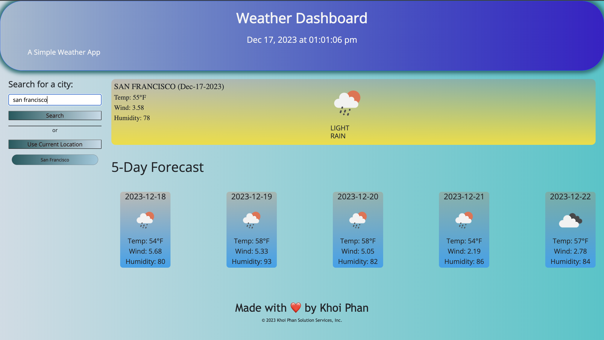
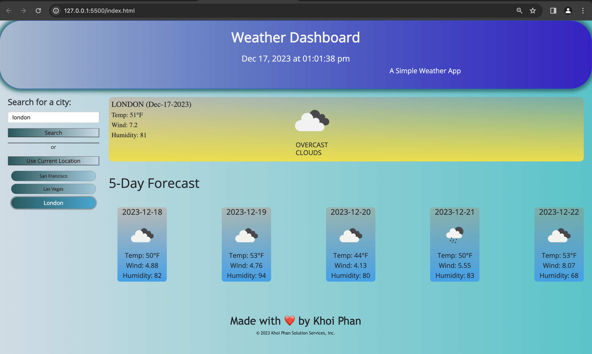

# Server-Side-APIs-Weather-Dashboard
hw 6, javascript, jquery, api css
 * In order to run the application, click on the [Weather-Dashboard Link](https://khoiphan-9194.github.io/Weather-Dashboard/)

## Application Description

A simple weather application that allows a user to search a location and then the application will display the current weather and 5-day forecast. It will also store the past search results allowing the user to select them and see that cities weather data again. This app runs in the browser and features dynamically updated HTML and CSS powered by jQuery.

## User Story

```md
AS A traveler
I WANT to see the weather outlook for multiple cities
SO THAT I can plan a trip accordingly
```

## Acceptance Criteria

```md
WHEN I search for a city
THEN I am presented with current and future conditions for that city and that city is added to the search history
WHEN I view current weather conditions for that city
THEN I am presented with the city name, the date, an icon representation of weather conditions, the temperature, the humidity, and the wind speed
WHEN I view future weather conditions for that city
THEN I am presented with a 5-day forecast that displays the date, an icon representation of weather conditions, the temperature, the wind speed, and the humidity
WHEN I click on a city in the search history
THEN I am again presented with current and future conditions for that city
```

The following animation demonstrates the application functionality:

## Built With
    HTML
    CSS
    JavaScript
    JSON
    jQuery
    Bootstrap
    OpenWeather API


## Pseudo Code for CSS

1. HTML attributes and classes

## Pseudo Code for JavaScript
📝 script.js
    created a function to read an API to get location data
    created a function to read the weather and forecast information
    assigned to a variable and pushed the information into an array
    function to display the weather data created
    function to search by city created
    saved city information in local storage

Below are images of the user interface of the calendar as displayed to the user:






URL to deployed application: https://khoiphan-9194.github.io/Weather-Dashboard/


URL to GitHub repository: https://github.com/khoiphan-9194/Weather-Dashboard


For any questions, please contact me at phanminhkhoi91@gmail.com